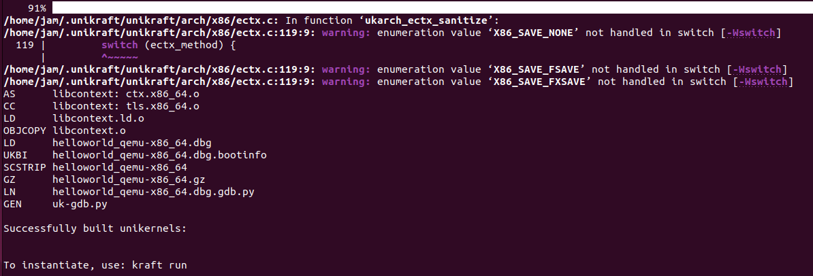

# Session—1

## Demo

### 1.编译并运行HelloWorld

#### 使用Kraft

在完成kraft的安装与基本配置后，可以通过kraft up命令进行一键构建

预期结果：

```
$ kraft up -t helloworld hello
 100.00% :::::::::::::::::::::::::::::::::::::::: |       21 /       21 |:  app/helloworld@0.10.0
[INFO    ] Initialized new unikraft application: /home/unikraft/hello
make: Entering directory '/home/unikraft/.unikraft/unikraft'
[...]
#
# configuration written to /home/unikraft/hello/.config
#
[...]
CC      libkvmplat: trace.common.o
CC      libkvmplat: traps.isr.o
CC      libkvmplat: cpu_features.common.o
[...]
CC      libnolibc: errno.o
CC      libnolibc: stdio.o
CC      libnolibc: ctype.o
[...]
LD      hello_kvm-x86_64.ld.o
OBJCOPY hello_kvm-x86_64.o
LD      hello_kvm-x86_64.dbg
SCSTRIP hello_kvm-x86_64
GZ      hello_kvm-x86_64.gz
LN      hello_kvm-x86_64.dbg.gdb.py
[...]
Successfully built unikernels:

  => build/hello_kvm-x86_64
  => build/hello_kvm-x86_64.dbg (with symbols)

[...]
To instantiate, use: kraft run
[...]
Starting VM...
[...]
                   Phoebe 0.10.0~3a997c1
Hello world!
Arguments:  "/home/unikraft/hello/build/hello_kvm-x86_64" "console=ttyS0"
```

理论上kraft将完成以下操作：

1. 创建hello目录并拉取helloworld应用
2. 完成应用配置，生成.config配置文件
3. 编译并链接配置中指定的组分，生成build/hello_kvm-x86_64镜像
4. 运行镜像并打印helloworld

然而我的运行结果与预期有些偏差：



虽然完成了编译链接的工作，但是并没有显示生成镜像的名称，仔细对照的话可以发现最终生成的镜像名称为helloworld_qemu-x86_64而非helloworld_kvm-x86_64，具体原因可以参考 [Unikraft releases v0.13.0 (Atlas)](https://unikraft.org/blog/2023-05-15-unikraft-releases-atlas/) 中[#760](https://github.com/unikraft/unikraft/pull/760) 

```
简而言之在unikraft v0.13.0后，由于加入对Firecracker VMM的支持，输出镜像的名称将从kvm改为具体的平台名，这是此处输出名中带qemu而非kvm的原因
```

#### 一步步构建

上述方式通过Kraft命令进行一键构建，下面通过手动构建更直观体验镜像构建的过程

在上述文档，拉取应用程序

```
git clone https://github.com/unikraft/app-helloworld.git helloworld-manual
```

例如我安装的unikraft路径为：/home/$USER/.unikraft/unikraft，根据路径修改Makefile为：

```
UK_ROOT ?= $(HOME)/.unikraft/unikraft
UK_LIBS ?= $(HOME)/.unikraft/libs
LIBS :=

all:
        @$(MAKE) -C $(UK_ROOT) A=$(PWD) L=$(LIBS)

$(MAKECMDGOALS):
        @$(MAKE) -C $(UK_ROOT) A=$(PWD) L=$(LIBS) $(MAKECMDGOALS)
```

通过菜单进行镜像构建配置

```
make menuconfig
```

由于系统架构与默认架构（x86）一致，此处配置平台即可：


选择kvm与Linux user space（基于namespace机制，受限度较高）


保存配置信息，编译链接生成镜像并运行


镜像运行成功，符合预期结果

### 运行httpreply应用

整体构建流程与HelloWorld类似，由于httpreply应用需要使用网络相关库，在构建时需要添加lwip库

```
// 获取lwip库依赖
git clone https://github.com/unikraft/lib-lwip ~/.unikraft/libs/lwip

// 在Makefile中添加lwip库依赖

```

在配置中的Library Configuration下，选择lwip库依赖


添加虚拟网桥，为虚拟机分配ip使其能够与宿主机通信

```
sudo brctl addbr br0
sudo ip a a  172.44.0.1/24 dev br0
sudo ip l set dev br0 up
sudo qemu-system-x86_64 -netdev bridge,id=en0,br=br0 -device virtio-net-pci,netdev=en0 -append "netdev.ipv4_addr=172.44.0.2 netdev.ipv4_gw_addr=172.44.0.1 netdev.ipv4_subnet_mask=255.255.255.0 --" -kernel build/httpreply_qemu-x86_64 -nographic
```


运行镜像，网络模块功能正常，成功从vm中获取index文件

## 实践练习

### Echo-back Server

相当于是实现一个简单的Echo Server，不过需要自己补全main.c中的内容并添加lwip库测试

首先根据提示信息，补全main.c中缺失的代码

```
main方法中：

// TODO: open socket fd;
// listen_fd = ...
listen_fd = socket(AF_INET, SOCK_STREAM, 0);


// TODO: bind() the socket;
// err = ...
err = bind(listen_fd, &serv_addr, sizeof(serv_addr));

// TODO: accept() new connection;
// conn_fd = ...
conn_fd = accept(listen_fd, &client_addr, &socket_len);

// TODO: close file descriptors
close(conn_fd);
close(listen_fd);

receive_and_send方法中：

// TODO:  recv() buffer into buf;
// bytes_received = ...
bytes_received = recv(client_recvfd, buf, BUFLEN, 0);

// TODO: send() buf back;
// bytes_send = ...
bytes_send = send(client_sendfd, buf, BUFLEN, 0);
```

简单介绍一下这些函数的基本功能与使用方式

```
int socket(int domain, int type, int protocol);
基本功能：创建一个套接字以用于通信，返回一个文件描述符标识该套接字
参数描述：
       domain：  指定通信使用的协议族，示例中AF_INET表示使用Ipv4协议
       type：    指定通信语义，示例中SOCK_STREAM表示提供有序、可靠、双端的、基于连接的字节流
       protocol：制定通信使用的细分协议，一般为0（表示协议族只有一个协议支持的一般情况）
       
int bind(int sockfd, const struct sockaddr *addr, socklen_t addrlen);
基本功能：为套接字分配地址
参数描述：
       sockfd：  要绑定套接字的文件描述符
       addr：    指向sockaddr结构的指针
       addrlen： sockaddr结构的长度
附：
sockaddr描述要绑定的地址信息，结构长度随协议族的变化而变化，其一般定义类似：
struct sockaddr {
    sa_family_t sa_family;
    char        sa_data[14];
}

int accept(int sockfd, struct sockaddr *_Nullable restrict addr, socklen_t *_Nullable restrict addrlen);
基本功能： 从监听套接字的等待队列中封装首部连接的信息，创建新的套接字与文件描述符指向新的套接字，成功返回0，其余情况返回-1
参数描述：
       sockfd： 监听套接字的文件描述符
       addr：   指向sockaddr结构的指针，用于填充远端套接字的地址信息
       addrLen：sockaddr结构的长度
       
int close(int fd);
基本功能：关闭文件描述符，释放该文件对应的相关资源，成功返回0，其余情况返回-1
参数描述：
       fd：     要关闭的文件描述符
       
ssize_t recv(int sockfd, void buf[.len], size_t len, int flags);
基本功能：从套接字获取消息，返回读取道消息的长度。某些情况下可能返回-1，详细错误信息需要参照错误码得出
参数描述：
       sockfd：要读取套接字的文件描述符
       buf：   接受消息的缓冲区
       len：   允许读取的最大长度
       flag：  控制读取的操作，0表示常规读取
       
ssize_t send(int sockfd, void buf[.len], size_t len, int flags);
基本功能：向套接字发送消息，返回成功发送消息的长度。某些情况下可能返回-1，详细错误信息需要参照错误码得出
参数描述：
       sockfd：要发送套接字的文件描述符
       buf：   存放消息的缓冲区
       len：   预计发送的最大长度
       flag：  控制发送的操作，0表示常规发送
```

与httpreply类似，添加lwip依赖，make构建镜像后测试运行效果：


测试交互效果，像虚拟机程序发送的字符串都会被重新发送回来，达到了Echo Server基本的行为预期

### ROT-13

依据提示，在lwip/sockets.c中加入rot13方法实现

```
void rot13(char *buf)
{
    for (int i = 0; buf[i] != '\0'; i++) {
        if ((buf[i] >= 'A' && buf[i] <= 'M') || (buf[i] >= 'a' && buf[i] <= 'm')) {
            buf[i] += 13;
        } else if ((buf[i] >= 'N' && buf[i] <= 'Z') || (buf[i] >= 'n' && buf[i] <= 'z')) {
            buf[i] -= 13;
        }
    }
}
```

在lwip/include/sys/socket,h中添加rot13函数声明

```
void rot13(char *buf);
```

在main.c中添加对rot13函数的调用

```
// After receive buffer
rot13(buf)
// Before send buffer
```

测试回显效果


结果对比与预期相符

### Store-String

docs中提供的会出现无法编译的情况，询问后得知该任务可能过期导致编译无法通过


由于app-nginx能够正常运作，此处借用了Session3的思想，将httpreply的具体实现放入了Nginx中，main仅仅作为一个方法中转

```
extern int mini_custom_server(int argc, char* argv[]);

int main(int argc, char* argv[])
{
    return mini_custom_server(argc, argv);
}
```

具体实现如下

```
void rot13(char *msg) {
    for (; *msg; msg++) {
        if (*msg == '\n') {
            continue;
        }

        if ((*msg > 'm' && *msg < 'z') || (*msg > 'M' && *msg < 'Z')) {
            *msg = *msg - 13;

        } else {
            *msg = *msg + 13;
        }
    }
}

int receive_and_send(int file_fd, int client_recvfd, int client_sendfd)
{
    char buf[BUFLEN];
    int bytes_send;
    int bytes_received = 0;

    memset(buf, 0, BUFLEN);
    bytes_received = recv(client_recvfd, buf, BUFLEN, 0);
    if (bytes_received < 0) {
        fprintf(stderr, "bytes_received recv");
        return -1;
    }

    write(file_fd, buf, bytes_received);

    rot13(buf);

    bytes_send = send(client_sendfd, buf, BUFLEN, 0);
    if (bytes_send < 0) {
        fprintf(stderr, "bytes_send send");
        return -1;
    }

    return bytes_received;
}

int main(int argc, char* argv[])
{
    int listen_fd = -1;
    struct sockaddr_in serv_addr;

    int file_fd = open("my_strings.txt", O_WRONLY | O_CREAT | O_TRUNC, 0644);
    if (file_fd < 0) {
        fprintf(stderr, "open");
        return 1;
    }

    lseek(file_fd, 0, SEEK_SET);

    listen_fd = socket(AF_INET, SOCK_STREAM, 0);
    if (listen_fd < 0) {
        fprintf(stderr, "socket");
        return 1;
    }

    int enable = 1;
    if (setsockopt(listen_fd, SOL_SOCKET, SO_REUSEADDR, &enable, sizeof(int)) == -1) {
        fprintf(stderr, "setsocketopt");
        return 1;
    }

    serv_addr.sin_family = AF_INET;
    serv_addr.sin_port = htons(LISTEN_PORT);
    serv_addr.sin_addr.s_addr = INADDR_ANY;

    int err = bind(listen_fd, (struct sockaddr *)&serv_addr, sizeof(serv_addr));
    if (err < 0) {
        fprintf(stderr, "bind");
        return 1;
    }

    struct sockaddr_in client_addr;

    int bytes_received;
    int conn_fd = -1;
    socklen_t socket_len = sizeof(struct sockaddr_in);

    listen(listen_fd, 1);

    conn_fd = accept(listen_fd, (struct sockaddr*)&client_addr, &socket_len);
    if (conn_fd < 0) {
        fprintf(stderr, "conn_fd accept");
        return 1;
    }

    do {
        bytes_received = receive_and_send(file_fd, conn_fd, conn_fd);
    } while (bytes_received > 0);

    close(conn_fd);

    close(listen_fd);

    close(file_fd);

    return 0;
}
```

运行结果基本正常


打开文件，正常记录接收到的内容

