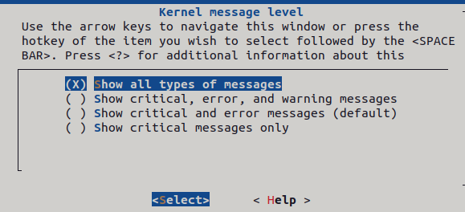
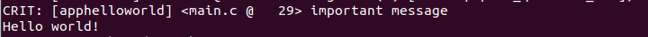
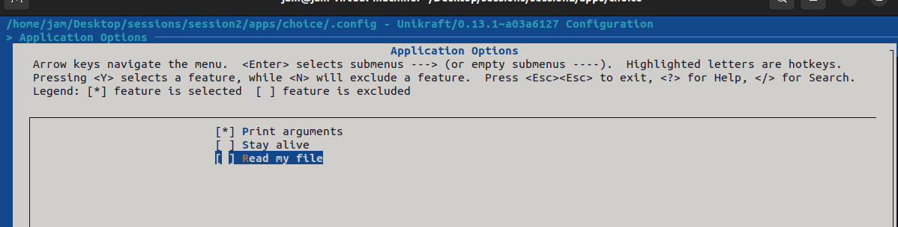

# Session2

## 概览

### 虚拟化

通过虚拟化可以在同一个硬件上运行不同的OS，每个OS都认为它们掌控了全部的系统。可以通过hypervisor，其是一种底层的软件能够虚拟化硬件并且管理硬件与上层的交互，可以直接管理也可以通过宿主OS管理，目前主要有虚拟机与容器两种主要的虚拟化环境

### 虚拟机

虚拟机表示能够运行OS的虚拟化后的硬件。虚拟机依赖hypervisor运行，hypervisor可以划分为两种类型：


- 第一种被称为裸机管理程序，直接与硬件交互并且控制运行与其之上的OS。KVM便是这种风格
- 第二种被称为托管管理程序，必须与OS交互来控制硬件。VirtualBox便是其中的代表

### 容器

容器是一种只包含一个应用程序及其依赖的沙盒环境，其容量较小。容器会被容器管理引擎锁管理，例如Docker，容器依赖于宿主OS


### Unikraft

Unikraft兼具容器小容量与虚拟机的强大特性。其可以直接控制硬件组分，使其具备一般OS所缺少的优势。Unikraft既可以在裸机也可以通过hypervisor运行


### linuxu 与 KVM

KVM方式可以像一个独立OS一样运行，而linuxu依赖于Linux用户态程序，受到用户态切换的制约。

### Unikraft Core

- 架构代码：定义特定架构硬件的行为与交互方式，如：x86包含x86架构上的寄存器定义、数据类型大小定义与如何使用thread local 存储
- 平台代码：定义与硬件的交互方式，具体方式取决于是否使用hypervisor、hypervisor的类型等因素
- 内部库：定义独立于硬件的调度、内存分配、基础文件系统等模块。

### libc

- nolibc：最小实现
- isrlibc：中断风格的nolibc变种，主要用于中断处理
- newlibc：写稿时最完整的libc，仍然缺少多线程等模块，一般用于嵌入式情景
- musl：理论上最好的libc，目前已成为默认使用

#### 配置Unikraft：Config.uk

在Config.uk中添加组分，依赖将会在组分准备完毕后被添加。可以通过Config.uk中的depends on与select关键字实现

### 构建系统

.config文件构建后，标志已经被定义。Makefile.uk最终加入源码文件并添加库，将选中的文件编译汇编，最终形成Unikraft镜像

****

## Practice

### Building and Running Unikraft

这部分与Session1的demo高度重合，此处仅记录一些差一点

#### 清除环境

```
make distclean
```

删除 build 目录与配置文件。一般最好在执行前确保之前的镜像与配置文件已经删除，免得后面重新构建出现错误

```
make properclean
```

删除build目录但是保留.config文件

#### 运行

```
 sudo qemu-system-x86_64 -kernel ./build/app-helloworld_kvm-x86_64 -nographic
 此命令实际以仿真模式运行
 
 sudo qemu-system-x86_64 -enable-kvm -cpu host -kernel ./build/app-helloworld_kvm-x86_64 -nographic
 以虚拟化模式运行
 参数意义：
     -enable-kvm 采用kvm虚拟化模式
     -cpu host   使用本机cpu模式
     
```

构建arm平台的helloworld镜像，通过以下命令运行

```
sudo qemu-system-aarch64 -machine virt -cpu cortex-a57 -kernel ./build/helloworld_qemu-arm64 -nographic
```


### Make it speak


勾选ukdebug中 Enable debug messages globally选项


可以再调试信息中看到初始化的信息以及对应的代码位置，以下是具体信息

### More Messages



在message level中，选择展示所有信息

```
Booting from ROM..Info: [libkvmplat] <bootinfo.c @   56> Unikraft Atlas (0.13.1~a03a6127)
Info: [libkvmplat] <bootinfo.c @   59> Architecture: x86_64
Info: [libkvmplat] <bootinfo.c @   62> Boot loader : qemu-multiboot
Info: [libkvmplat] <bootinfo.c @   67> Command line: build/speak_qemu-x86_64 
Info: [libkvmplat] <bootinfo.c @   69> Boot memory map:
Info: [libkvmplat] <bootinfo.c @  101>  000000100000-00000011b000 00000001b000 r-x 0000000000100000 krnl 
Info: [libkvmplat] <bootinfo.c @  101>  00000011b000-000000123000 000000008000 r-- 000000000011b000 krnl 
Info: [libkvmplat] <bootinfo.c @  101>  000000123000-000000171000 00000004e000 rw- 0000000000123000 krnl 
Info: [libkvmplat] <bootinfo.c @  101>  000000122060-000000122060 000000000000 rw- 0000000000122060 krnl 
Info: [libkvmplat] <bootinfo.c @  101>  000000171000-000000171018 000000000018 r-- 0000000000171000 cmdl 
Info: [libkvmplat] <bootinfo.c @  101>  000000172000-000000173000 000000001000 rw- 0000000000172000 cmdl 
Info: [libkvmplat] <bootinfo.c @  101>  000000173000-000000183000 000000010000 rw- 0000000000173000 stck 
Info: [libkvmplat] <bootinfo.c @  101>  000000183000-000007fe0000 000007e5d000 rw- 0000000000183000  
Info: [libkvmplat] <bootinfo.c @  101>  000007fe0000-000008000000 000000020000 r-- 0000000007fe0000 rsvd 
Info: [libkvmplat] <bootinfo.c @  101>  0000feffc000-0000ff000000 000000004000 r-- 00000000feffc000 rsvd 
Info: [libkvmplat] <bootinfo.c @  101>  0000fffc0000-000100000000 000000040000 r-- 00000000fffc0000 rsvd 
Info: [libkvmplat] <setup.c @  374> Switch from bootstrap stack to stack @0x183000
Info: [libukboot] <boot.c @  251> Unikraft constructor table at 0x122000 - 0x122018
dbg:  [libukboot] <boot.c @  255> Call constructor: 0x1198e0())...
dbg:  [libcontext] <ectx.c @   84> Load/store of extended CPU state: FXSAVE
dbg:  [libukboot] <boot.c @  255> Call constructor: 0x10bbc0())...
dbg:  [libukbus] <bus.c @   52> Register bus handler: 0x123000
dbg:  [libukboot] <boot.c @  255> Call constructor: 0x10c2c0())...
dbg:  [libukbus] <bus.c @   52> Register bus handler: 0x123060
Info: [libukboot] <boot.c @  288> Initialize memory allocator...
dbg:  [libukboot] <boot.c @  189> Trying 0x183000-0x7fe0000 0x03 
Info: [libukallocbbuddy] <bbuddy.c @  515> Initialize binary buddy allocator 183000
dbg:  [libukallocbbuddy] <bbuddy.c @  471> 183000: Add allocate unit 185000 - 186000 (order 0)
dbg:  [libukallocbbuddy] <bbuddy.c @  471> 183000: Add allocate unit 186000 - 188000 (order 1)
dbg:  [libukallocbbuddy] <bbuddy.c @  471> 183000: Add allocate unit 188000 - 190000 (order 3)
dbg:  [libukallocbbuddy] <bbuddy.c @  471> 183000: Add allocate unit 190000 - 1a0000 (order 4)
dbg:  [libukallocbbuddy] <bbuddy.c @  471> 183000: Add allocate unit 1a0000 - 1c0000 (order 5)
dbg:  [libukallocbbuddy] <bbuddy.c @  471> 183000: Add allocate unit 1c0000 - 200000 (order 6)
dbg:  [libukallocbbuddy] <bbuddy.c @  471> 183000: Add allocate unit 200000 - 400000 (order 9)
dbg:  [libukallocbbuddy] <bbuddy.c @  471> 183000: Add allocate unit 400000 - 800000 (order 10)
dbg:  [libukallocbbuddy] <bbuddy.c @  471> 183000: Add allocate unit 800000 - 1000000 (order 11)
dbg:  [libukallocbbuddy] <bbuddy.c @  471> 183000: Add allocate unit 1000000 - 2000000 (order 12)
dbg:  [libukallocbbuddy] <bbuddy.c @  471> 183000: Add allocate unit 2000000 - 4000000 (order 13)
dbg:  [libukallocbbuddy] <bbuddy.c @  471> 183000: Add allocate unit 4000000 - 6000000 (order 13)
dbg:  [libukallocbbuddy] <bbuddy.c @  471> 183000: Add allocate unit 6000000 - 7000000 (order 12)
dbg:  [libukallocbbuddy] <bbuddy.c @  471> 183000: Add allocate unit 7000000 - 7800000 (order 11)
dbg:  [libukallocbbuddy] <bbuddy.c @  471> 183000: Add allocate unit 7800000 - 7c00000 (order 10)
dbg:  [libukallocbbuddy] <bbuddy.c @  471> 183000: Add allocate unit 7c00000 - 7e00000 (order 9)
dbg:  [libukallocbbuddy] <bbuddy.c @  471> 183000: Add allocate unit 7e00000 - 7f00000 (order 8)
dbg:  [libukallocbbuddy] <bbuddy.c @  471> 183000: Add allocate unit 7f00000 - 7f80000 (order 7)
dbg:  [libukallocbbuddy] <bbuddy.c @  471> 183000: Add allocate unit 7f80000 - 7fc0000 (order 6)
dbg:  [libukallocbbuddy] <bbuddy.c @  471> 183000: Add allocate unit 7fc0000 - 7fe0000 (order 5)
dbg:  [libcontext] <tls.c @  173> tls_area_init: target: 0x185020 (16 bytes)
dbg:  [libcontext] <tls.c @  175> tls_area_init: copy (.tdata): 0 bytes
dbg:  [libcontext] <tls.c @  177> tls_area_init: uninitialized (.tbss): 4 bytes
dbg:  [libcontext] <tls.c @  179> tls_area_init: pad: 4 bytes
dbg:  [libcontext] <tls.c @  181> tls_area_init: tcb: 8 bytes
dbg:  [libcontext] <tls.c @  183> tls_area_init: tcb self ptr: 0x185028
dbg:  [libcontext] <tls.c @  204> (tls_area): 00185020  00 00 00 00 00 00 00 00  28 50 18 00 00 00 00 00  |........(P......|
Info: [libukboot] <boot.c @  313> Initialize IRQ subsystem...
Info: [libukboot] <boot.c @  320> Initialize platform time...
Info: [libkvmplat] <tscclock.c @  255> Calibrating TSC clock against i8254 timer
Info: [libkvmplat] <tscclock.c @  276> Clock source: TSC, frequency estimate is 2096944930 Hz
Info: [libukboot] <boot.c @  324> Initialize scheduling...
Info: [libukschedcoop] <schedcoop.c @  257> Initializing cooperative scheduler
dbg:  [libuksched] <thread.c @  254> uk_thread 0x1860b8 (idle): ctx:0x1860b8, ectx:0x187030, tlsp:0x187028
dbg:  [libcontext] <tls.c @  173> tls_area_init: target: 0x187020 (16 bytes)
dbg:  [libcontext] <tls.c @  175> tls_area_init: copy (.tdata): 0 bytes
dbg:  [libcontext] <tls.c @  177> tls_area_init: uninitialized (.tbss): 4 bytes
dbg:  [libcontext] <tls.c @  179> tls_area_init: pad: 4 bytes
dbg:  [libcontext] <tls.c @  181> tls_area_init: tcb: 8 bytes
dbg:  [libcontext] <tls.c @  183> tls_area_init: tcb self ptr: 0x187028
dbg:  [libcontext] <tls.c @  204> (tls_area): 00187020  00 00 00 00 00 00 00 00  28 70 18 00 00 00 00 00  |........(p......|
dbg:  [libcontext] <ctx.c @  133> ukarch_ctx 0x1860b8: entry:0x117e10(186020), sp:0x7fd0018
dbg:  [libuksched] <thread.c @  254> uk_thread 0x188020 (init): ctx:0x188020, ectx:0x1880d0, tlsp:0x185028
Info: [libukboot] <boot.c @  339> Init Table @ 0x122018 - 0x122020
dbg:  [libukboot] <boot.c @  343> Call init function: 0x114610()...
Info: [libukbus] <bus.c @  134> Initialize bus handlers...
dbg:  [libukbus] <bus.c @   76> Initialize bus handler 0x123000...
dbg:  [libukbus] <bus.c @   76> Initialize bus handler 0x123060...
Info: [libukbus] <bus.c @  136> Probe buses...
dbg:  [libukbus] <bus.c @   88> Probe bus 0x123000...
dbg:  [libkvmpci] <pci_bus_x86.c @  213> Probe PCI
Info: [libkvmpci] <pci_bus_x86.c @  158> PCI 00:00.00 (0600 8086:1237): <no driver>
Info: [libkvmpci] <pci_bus_x86.c @  158> PCI 00:01.00 (0600 8086:7000): <no driver>
Info: [libkvmpci] <pci_bus_x86.c @  158> PCI 00:02.00 (0300 1234:1111): <no driver>
Info: [libkvmpci] <pci_bus_x86.c @  158> PCI 00:03.00 (0200 8086:100e): <no driver>
dbg:  [libukbus] <bus.c @   88> Probe bus 0x123060...
Powered by
o.   .o       _ _               __ _
Oo   Oo  ___ (_) | __ __  __ _ ' _) :_
oO   oO ' _ `| | |/ /  _)' _` | |_|  _)
oOo oOO| | | | |   (| | | (_) |  _) :_
 OoOoO ._, ._:_:_,\_._,  .__,_:_, \___)
                  Atlas 0.13.1~a03a6127
Info: [libukboot] <boot.c @  369> Pre-init table at 0x122060 - 0x122060
Info: [libukboot] <boot.c @  380> Constructor table at 0x122060 - 0x122060
Info: [libukboot] <boot.c @  401> Calling main(1, ['build/speak_qemu-x86_64'])
Hello world!
Arguments:  "build/speak_qemu-x86_64"
Info: [libukboot] <boot.c @  410> main returned 0, halting system
Info: [libkvmplat] <shutdown.c @   35> Unikraft halted
```

启动时展示了更多的调试信息

### Going through the Code

```
Booting from ROM..Info: [libkvmplat] <bootinfo.c @   56> Unikraft Atlas (0.13.1~a03a6127)
```

以第一条信息为例，可以在unikraft/plat目录下找到unikraft/plat/common/bootinfo.c

在bootinfo.c的56行中，可以看到调试信息的打印函数

```
	uk_pr_info("Unikraft " STRINGIFY(UK_CODENAME)
		   " (" STRINGIFY(UK_FULLVERSION) ")\n");
```

对于main函数，根据调试信息，发现是在boot.c的401行处调用

```
uk_pr_info("Calling main(%d, [", argc);
	for (i = 0; i < argc; ++i) {
		uk_pr_info("'%s'", argv[i]);
		if ((i + 1) < argc)
			uk_pr_info(", ");
	}
	uk_pr_info("])\n");

	rc = main(argc, argv);
	uk_pr_info("main returned %d, halting system\n", rc);
	rc = (rc != 0) ? UKPLAT_CRASH : UKPLAT_HALT;
```

在main中插入语句

```
uk_pr_info("important message\n");
```


可以看到输出info级别信息

更改输出级别，可以发现调试信息的级别前缀发生变化




### Adding Filesystem to Application

拷贝docs中的work/06-adding-filesystems/至工作目录

增加依赖musl并在libs中拉取musl库

```
LIBS := $(UK_LIBS)/lib-musl
```

在配置项中，勾选musl并配置挂载信息


运行镜像，成功输出文件中的内容


对本例qemu的运行参数的基本解释

```
-fsdev local,id=myid,path=guest_fs,security_model=none：向guest_fs文件夹分配myid
-device virtio-9p-pci,fsdev=myid,mount_tag=fs0：创建9pfs类型的设备，向上述配置的fsdev分配fs0的mount tag
```

### Give the User a Choice

向Config.uk中加入配置项

```
config APPHELLOWORLD_READFILE
	bool "Read my file"
	default n
	help
	  Reads the file in guest_fs/ and prints its contents,
	  instead of printing helloworld
```

修改main.c

```
#ifndef CONFIG_APPHELLOWORLD_READFILE
	printf("Hello world!\n");
#else
	FILE *in = fopen("file", "r");
	char buffer[100];

	fread(buffer, 1, 100, in);
	printf("File contents: %s\n", buffer);
	fclose(in);
#endif
```

可以通过Appilcation Options选择是否读取文件



未勾选时仅仅打印Hello World


勾选后，如同预期打印文件内容


### Arguments from Command Line

克隆新的helloworld，在Application Options中勾选 print arguments


通过append选项添加参数

```
qemu-system-x86_64 -kernel build/arguments_qemu-x86_64 -append "console=ttyS0 foo=bar" -nographic
```

如预期打印参数信息


### Adding a new source file

编写qsort.c，实现快排算法

修改main.c，使用qsort实现QuickSort

```
// printf("Hello world!\n");
	int arr[] = {8,7,6,5,4,3,2,1};
	QuickSort(arr, 0, 7);
	printf("after sorting:");
	for (int arr_index = 0; arr_index < 8; arr_index++) {
	    printf(" %d", arr[arr_index]);
	}
	printf("\n");
```

初步验证文件添加成功

