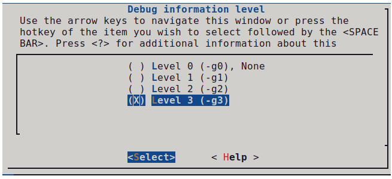
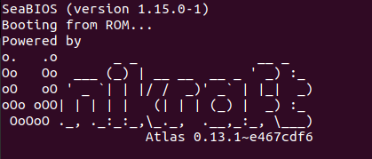
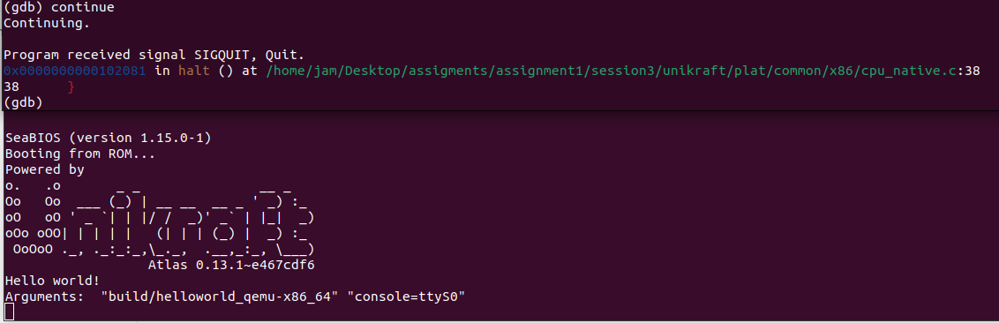
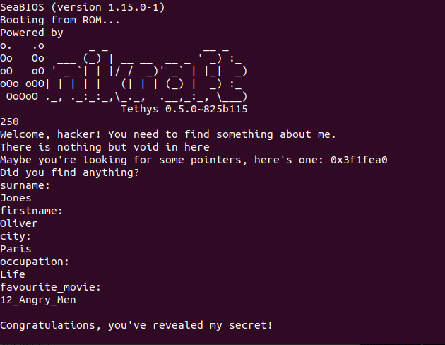
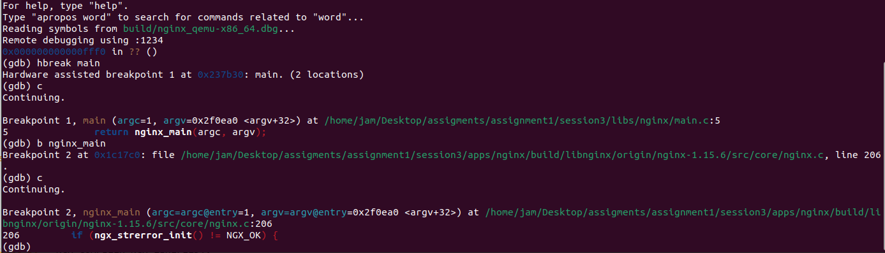
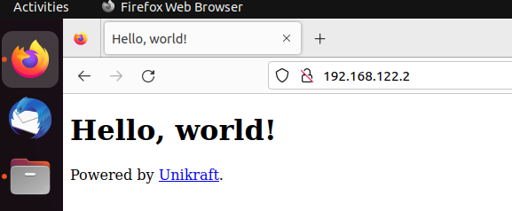

# Session3: Debugging

## 概要

### 调试

与一般传统印象不同，在unikraft中的调试比起一般操作系统更加简单，因为unikraft将应用于OS链接为同一个二进制文件。以下是开始调试前需要了解的一些信息：

- 进行调试功能，将Build Options中的Drop unused functions and data关闭
- 可以通过make V=1更加详细了解编译出错的原因
- 如果想要更加快速的理解调试过程，生成linuxu平台的镜像

### GDB在Unikraft中的使用

在Build Options中，选择level 3



以下是个平台的调试命令

#### Linuxu

```
gdb build/app-helloworld_linuxu-x86_64.dbg
```

#### KVM

```
qemu-system-x86_64 -s -S -cpu host -enable-kvm -m 128 -nodefaults -no-acpi -display none -nographic -device isa-debug-exit -kernel build/app-helloworld_kvm-x86_64 -append verbose
qemu-guest -P -g 1234 -k build/app-helloworld_kvm-x86_64
gdb --eval-command="target remote :1234" build/app-helloworld_kvm-x86_64.dbg
```

## Work

### Tutorial. Use GDB in Unikraft

构建helloworld镜像，构建完毕后获取qemu-guest脚本

```
$ wget https://github.com/unikraft/unikraft/blob/staging/support/scripts/qemu-guest

$ chmod a+x qemu-guest
```

启动镜像，等待gdb监听

```
./qemu-guest -P -g 1234 -k build/helloworld_qemu-x86_64
```

启动gdb并开始调试

```
gdb --eval-command="target remote :1234" build/helloworld_qemu-x86_64.dbg
```

在main处设置硬件断点，测试gdb是否生效

```
(gdb) hbreak main
Hardware assisted breakpoint 1 at 0x119410: main. (2 locations)
(gdb) continue
Continuing.

Breakpoint 1, main (argc=2, argv=0x170d40 <argv>) at /home/jam/Desktop/assigments/assignment1/session3/apps/app-helloworld/main.c:27
27	{
(gdb) 
```

可以看到当执行到main入口处执行中断，镜像也并未打出helloworld



继续执行，镜像显示正常输出



### Mystery: Find the secret using GDB

开始前，介绍一些gdb的基本指令

- ni：进入下一条语句，跳过函数执行
- si：进入下一条语句，不跳过函数执行
- c：执行直到遇到下一个断点或者程序结束
- p expr：展示表达式的值
- x addr：展示地址处储存的值
- whatis arg：展示arg类型的值

本节的任务是通过gdb调试找到隐藏的讯息，在不了解程序上下文的情况下破解难度较大，下面简单叙述以下破解思路

调试程序到unevilmystery处

```
SeaBIOS (version 1.15.0-1)
Booting from ROM...
Powered by
o.   .o       _ _               __ _
Oo   Oo  ___ (_) | __ __  __ _ ' _) :_
oO   oO ' _ `| | |/ /  _)' _` | |_|  _)
oOo oOO| | | | |   (| | | (_) |  _) :_
 OoOoO ._, ._:_:_,\_._,  .__,_:_, \___)
                   Tethys 0.5.0~825b115
250
Welcome, hacker! You need to find something about me.
There is nothing but void in here
Maybe you're looking for some pointers, here's one: 0x3f1fea0
```

此时会打印一个指针信息，你需要的信息在对应的地址处，通过 x/nx 打印地址储存的信息：

```
0x3f1fea0:	0x656e6f4a	0x00000073	0x00000000	0x00000000
0x3f1feb0:	0x00000000	0x00000000	0x00000000	0x00000000
0x3f1fec0:	0x00000000	0x00000000	0x00000000	0x00000000
0x3f1fed0:	0x6c4f0000	0x72657669	0x00000000	0x00000000
0x3f1fee0:	0x00000000	0x00000000	0x00000000	0x00000000
0x3f1fef0:	0x00000000	0x00000000	0x00000000	0x00000000
0x3f1ff00:	0x00000000	0x69726150	0x00000073	0x00000000
0x3f1ff10:	0x00000000	0x00000000	0x00000000	0x00000000
0x3f1ff20:	0x00000000	0x00000000	0x00000000	0x00000000
0x3f1ff30:	0x00000000	0x694c0000	0x00006566	0x00000000
0x3f1ff40:	0x00000000	0x00000000	0x00000000	0x00000000
0x3f1ff50:	0x00000000	0x00000000	0x00000000	0x00000000
0x3f1ff60:	0x00000000	0x00000000	0x415f3231	0x7972676e
0x3f1ff70:	0x6e654d5f	0x00000000	0x00000000	0x00000000
0x3f1ff80:	0x00000000	0x00000000	0x00000000	0x00000000
0x3f1ff90:	0x00000000	0x00000000	0x0010e800	0x00000000
0x3f1ffa0:	0x0019d6c8	0x00000000	0x03fdff50	0x00000000
0x3f1ffb0:	0x001d0000	0x00000000	0x0600c108	0x00000000
0x3f1ffc0:	0x03f1ffe0	0x00000000	0x001096b5	0x00000000
0x3f1ffd0:	0x001095b0	0x00000000	0x001d4060	0x00000000
0x3f1ffe0:	0x00000000	0x00000000	0x00105762	0x00000000
0x3f1fff0:	0x00000000	0x00000000	0x00000000	0x00000000
0x3f20000:	0x00000000	0x00000000	0x00000000	0x00000000
0x3f20010:	0x00000000	0x00000000	0x00000000	0x00000000
0x3f20020:	0x00000000	0x00000000	0x00000000	0x00000000
```

通过ascii码对照，结合Unix平台小端序的特点，可以得知分别存储字符串：

```
0x656e6f4a	0x00000073  ->  Jones
0x6c4f0000	0x72657669  ->  Oliver
0x69726150	0x00000073  ->  Paris
0x694c0000	0x00006566  ->  Life
0x415f3231	0x7972676e  0x6e654d5f  ->  12_Angry_Men
```

依次输入信息，即可通过程序



由于破解难度较大且剩余时间不多，完成该task时参照了sol中的源程序，在此说明

### Bug or Feature

通过反汇编，可以得到运行片段

```
=> 0x0000000000111ac0 <+0>:	endbr64 
   0x0000000000111ac4 <+4>:	push   %rbp
   0x0000000000111ac5 <+5>:	xor    %esi,%esi
   0x0000000000111ac7 <+7>:	mov    %rsp,%rbp
   0x0000000000111aca <+10>:	sub    $0x190,%rsp
   0x0000000000111ad1 <+17>:	lea    -0x190(%rbp),%rax
   0x0000000000111ad8 <+24>:	lea    0x136f4(%rbp),%rdx
   0x0000000000111adf <+31>:	nop
   0x0000000000111ae0 <+32>:	add    (%rax),%esi
   0x0000000000111ae2 <+34>:	add    $0x4,%rax
   0x0000000000111ae6 <+38>:	cmp    %rdx,%rax
   0x0000000000111ae9 <+41>:	jne    0x111ae0 <main+32>
   0x0000000000111aeb <+43>:	mov    $0x114543,%edi
   0x0000000000111af0 <+48>:	xor    %eax,%eax
   0x0000000000111af2 <+50>:	call   0x10b8c0 <printf>
   0x0000000000111af7 <+55>:	xor    %eax,%eax
   0x0000000000111af9 <+57>:	leave  
   0x0000000000111afa <+58>:	ret    
```

重点关注rsp的变化，其中sub    $0x190,%rsp 分配了100字节的空间，但是通过rdx的简介访存远远超过了分配内存的界限，认为出现了类似数组越界的内存访问错误。个人认为是程序的BUG，由于unikraft的保护策略较为宽松而未出现segment fault情况的出现

### Nginx with or without main? 



通过调试可知，实际main.c在libs/nginx目录下，main函数仅仅调用nginx_main函数。

类似的，我们可以自己实现main.c文件

```
extern int nginx_main(int argc, char *argv[]);

int main(int argc, char *argv[])
{
	return nginx_main(argc, argv);
}
```

在Makefile.uk末尾处添加

```
APPNGINX_SRCS-y += $(APPNGINX_BASE)/main.c
```

测试运行，符合预期结果


