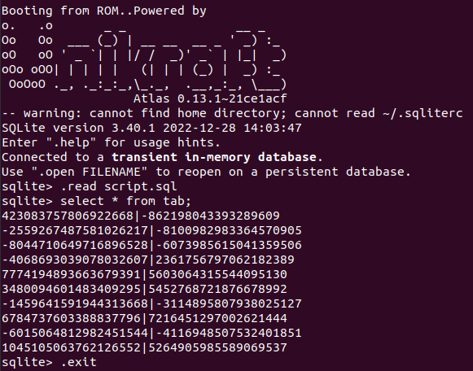
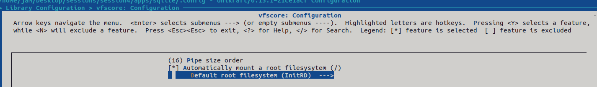
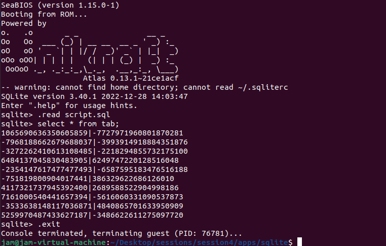
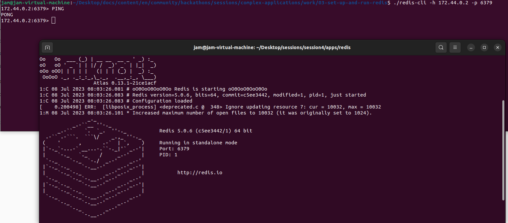
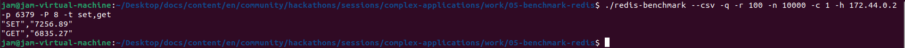
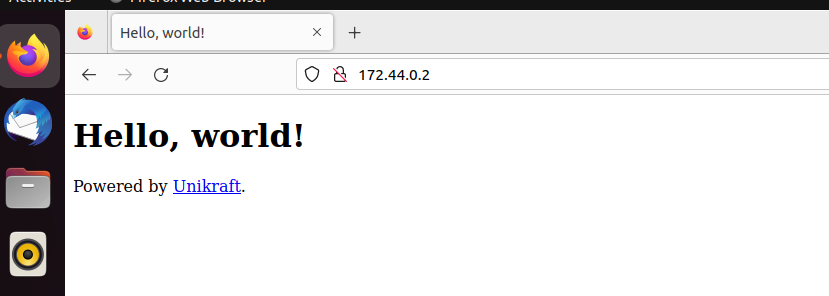
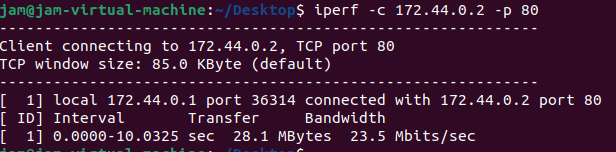

# Session-4: Complex  Applications

### SQLite

搭建基本环境后，编辑Makefile文件

```
UK_ROOT ?= $(PWD)/../../unikraft
UK_LIBS ?= $(PWD)/../../libs
LIBS := $(UK_LIBS)/lib-musl:$(UK_LIBS)/lib-sqlite

all:
	@$(MAKE) -C $(UK_ROOT) A=$(PWD) L=$(LIBS)

$(MAKECMDGOALS):
	@$(MAKE) -C $(UK_ROOT) A=$(PWD) L=$(LIBS) $(MAKECMDGOALS)
```

准备lib-musl与lib-sqlite依赖

配置时，注意选择 Virtio PCI device support与Virtio 9P device


运行验证



### SQLite New Filesystem

采用InitRD文件系统构建SQLite镜像



构建.cpio文件

```
find -type f | bsdcpio -o --format newc > ../archive.cpio

```

重新构建镜像后再次运行



### Redis (Tutorial)

修改Makefile，添加相应的依赖

```
UK_ROOT ?= $(PWD)/../../unikraft
UK_LIBS ?= $(PWD)/../../libs
LIBS := $(UK_LIBS)/musl:$(UK_LIBS)/lwip:$(UK_LIBS)/redis

all:
	@$(MAKE) -C $(UK_ROOT) A=$(PWD) L=$(LIBS)

$(MAKECMDGOALS):
	@$(MAKE) -C $(UK_ROOT) A=$(PWD) L=$(LIBS) $(MAKECMDGOALS)
```

按照下述命令启动：

```
sudo brctl addbr kraft0
sudo ifconfig kraft0 172.44.0.1
sudo ifconfig kraft0 up

sudo dnsmasq -d \
             -log-queries \
             --bind-dynamic \
             --interface=kraft0 \
             --listen-addr=172.44.0.1 \
             --dhcp-range=172.44.0.2,172.44.0.254,255.255.255.0,12h &> dnsmasq.logs &
在kraft0上启动DHCP服务


```

测试Redis应用构建，应用构建成功



### Redis Benchmark Test

运行下述命令，测试Redis吞吐量



### Nginx

与Redis步骤类似，构建Nginx镜像并运行



在页面输入虚拟机IP，可以看到Nginx导航页

### Nginx Benchmarking

安装必要依赖

```
sudo apt-get install -y iperf
```

采用iperf进行压测，结果如下：

