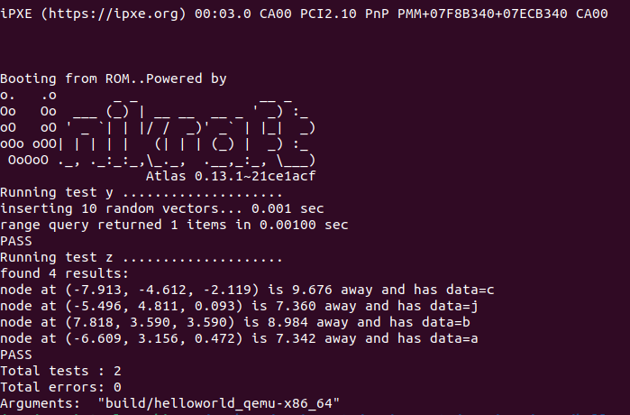

# Session-5: Contributing to Unikraft

## 概览

该session主要介绍如何为unikraft移植库。比如在app-nginx中只能看到Makefile等配置文件，真正的main方法执行发生在lib-nginx中。下面将通过实践介绍如何将外部库移植到Unikraft中。

## 实践与讲解

### 准备

在libs目录下，获取kdtree并解压

```
wget http://nuclear.mutantstargoat.com/sw/kdtree/files/kdtree-0.5.7.tar.gz
```

### 声明库标识

从docs中拷贝相应的必要文件至解压后的kdtree中，在Config.uk中声明库的标识

```
menuconfig LIBKDTREE
	bool "kdtree - simplify the use of kd-trees"
	default n
	select LIBMUSL
```

### 设置URL

构建后的文件均在build文件夹下，构建时需要下载库源文件，因此需要在Config.uk中指定库的下载URL

从kdtree的发布信息中可以获取到对应版本的详细信息

```
Latest release (0.5.7): http://nuclear.mutantstargoat.com/sw/kdtree/files/kdtree-0.5.7.tar.gz
You can find previous releases here: http://nuclear.mutantstargoat.com/sw/kdtree/files/
You can also grab a copy of the source from github: https://github.com/jtsiomb/kdtree
```

在Makefile.uk中指定相应的信息

```
################################################################################
# Original sources
################################################################################
LIBKDTREE_VERSION = 0.5.7
LIBKDTREE_URL = http://nuclear.mutantstargoat.com/sw/kdtree/files/kdtree-$(LIBKDTREE_VERSION).tar.gz
$(eval $(call fetch,libkdtree,$(LIBKDTREE_URL)))
```

### 定义Helper变量

定义库的解压路径，这样可以在运行 make prepare时通过app的Makefile文件下载并解压对应的库文件，在构建程序之前预先完成依赖构建

```
################################################################################
# Helpers
################################################################################
LIBKDTREE_EXTRACTED = $(LIBKDTREE_ORIGIN)/kdtree-$(LIBKDTREE_VERSION)
```

### Header位置

在编译库时需要添加库中头文件的编译配置，解压下载的源文件可以看到对应头文件的位置

```
./kdtree.h
./include/test_suite_glue.h
```

依照对应路径，在Makefile.uk中添加编译配置

```
################################################################################
# Library includes
################################################################################
LIBKDTREE_COMMON_INCLUDES-y     += -I$(LIBKDTREE_EXTRACTED)/
LIBKDTREE_COMMON_INCLUDES-y     += -I$(LIBKDTREE_BASE)/include

CINCLUDES-$(CONFIG_LIBKDTREE)   += $(LIBKDTREE_COMMON_INCLUDES-y)
CXXINCLUDES-$(CONFIG_LIBKDTREE) += $(LIBKDTREE_COMMON_INCLUDES-y)

LIBKDTREE_CINCLUDES   += -I$(LIBKDTREE_EXTRACTED)
LIBKDTREE_CXXINCLUDES += -I$(LIBKDTREE_EXTRACTED)
```

### 源文件配置

类似的，查找.c文件位置

```
./test_suite_glue.c
./examples/test2.c
./examples/test.c
```

在Makefile.uk中添加.c文件的对应配置

```
################################################################################
# LIBKDTREE code
################################################################################
LIBKDTREE_SRCS-y += $(LIBKDTREE_EXTRACTED)/kdtree.c
```

-Dmain更改了编译后对应文件的main的函数名，解决多个main定义冲突的问题

### 添加配置细节

之前配置在选中库时，通常可以勾选更多的细分选项，这可以通过在Config.uk中添加更多的配置规则完成

```
if LIBKDTREE
	config BUILD_TESTS
		bool "Build test suite"
		default n
		
	if BUILD_TESTS
		config TEST_1
			bool "Test 1"
			default y
		config TEST_2
			bool "Test 2"
			default y
	endif
endif
```

在勾选libkdtree的前提下，还可以选择是否在运行时进行自动测试，勾选测试后还可以指定是否运行测试用例1，测试用例2。这些功能的实现可以通过在Config.uk中添加相应的配置项并结合后续的编译具体规则实现

### 运行准备配置

某些库在获取后需要手动运行./configure生成对应的文件后才可以进行编译，依据kdtree的介绍配置获取kdtree后的配置编译等命令

```
################################################################################
# LIBKDTREE prepare
################################################################################
# Run ./configure
$(LIBKDTREE_EXTRACTED)/config.status: $(LIBKDTREE_BUILD)/.origin
	$(call verbose_cmd,CONFIG,libkdtree: $(notdir $@), \
		cd $(LIBKDTREE_EXTRACTED) && ./configure)

LIBKDTREE_PREPARED_DEPS = $(LIBKDTREE_EXTRACTED)/config.status

$(LIBKDTREE_BUILD)/.prepared: $(LIBKDTREE_PREPARED_DEPS)

UK_PREPARE += $(LIBKDTREE_BUILD)/.prepared
```

### 添加测试文件

与添加头文件与源文件的过程类似，添加测试需要的头文件与对应的源文件

```
################################################################################
# LIBKDTREE tests
################################################################################
LIBKDTREE_SRCS-$(CONFIG_TEST_1) += $(LIBKDTREE_EXTRACTED)/examples/test.c
LIBKDTREE_TEST_FLAGS-$(CONFIG_TEST_1) += -Dmain=test_y

LIBKDTREE_SRCS-$(CONFIG_TEST_2) += $(LIBKDTREE_EXTRACTED)/examples/test2.c
LIBKDTREE_TEST2_FLAGS-$(CONFIG_TEST_1) += -Dmain=test_z

LIBKDTREE_SRCS-$(CONFIG_BUILD_TESTS) += $(LIBKDTREE_BASE)/test_suite_glue.c
```

### 测试运行

在app应用中选择kdtree库并且运行所有测试用例，验证配置结果



测试用例运行成功，说明库移植的配置基本正确，能够达到基本的运行预期