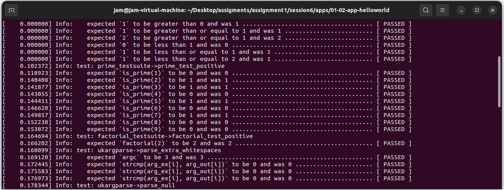
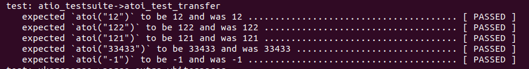
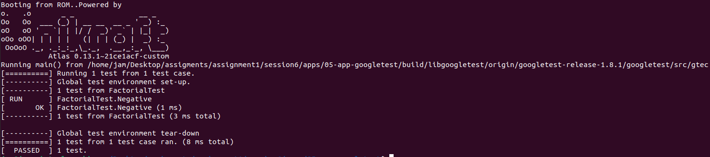

# Session-6: The Concept of Testing

## 概览

本session主要聚焦于Unikraft中的测试

一般主要有三种测试方式：单元测试、集成测试以及端到端测试。

- 端到端测试：测试所有的工作流
- 集成测试：测试某两个功能版块间的协调
- 单元测试：测试某一个模块或功能点

除此以外还有许多测试方式，此处了解最主要三种即可

### 测试框架

#### Linux测试

```
void example_add_test(struct kunit *test)
{
  /* check if calling add(1,0) is equal to 1 */
  KUNIT_EXPECT_EQ(test, 1, add(1, 0));
}
```

可以通过KUNIT_EXPECT_EQ宏验证结果

一系列测试可以组成一个测试集，下面是测试集的简单定义

```
static struct kunit_case example_add_cases[] = {
        KUNIT_CASE(example_add_test1),
        KUNIT_CASE(example_add_test2),
        KUNIT_CASE(example_add_test3),
        {}
};

static struct kunit_suite example_test_suite = {
        .name = "example",
        .init = example_test_init,
        .exit = example_test_exit,
        .test_cases = example_add_cases,
};
kunit_test_suite(example_test_suite);
```

#### OSV测试

以单独应用的形式组织测试

#### Google测试框架

```
#include "gtest/gtest.h"

int Factorial(int n) {
  int result = 1;
  for (int i = 1; i <= n; i++) {
    result *= i;
  }

  return result;
}

TEST(FactorialTest, Negative)
{
      EXPECT_EQ(1, Factorial(-5));
      EXPECT_EQ(1, Factorial(-1));
      EXPECT_GT(Factorial(-10), 0);
}

int main(int argc, char ∗∗argv) {
  ::testing::InitGoogleTest(&argc, argv);
  return RUN_ALL_TESTS();
}
```

测试功能强大，一般用于C++测试


### Unikraft一般测试方式

```
uk_testsuite_register(factorial_testsuite, NULL);

UK_TESTCASE(testsuite_name, testcase1_name)
{
	UK_TEST_EXPECT_SNUM_EQ(some_function(2), 2);
}

UK_TESTCASE(testsuite_name, testcase2_name)
{
	UK_TEST_EXPECT_SNUM_EQ(some_other_function(2), 2);
}
```

一般首先通过uk_testsuite_register 注册测试套件，通过UK_TESTCASE描述具体的测试用例


## Work

### Tutorial: Testing a Simple Application

在main.c中，实现阶乘函数

```
#include <uk/test.h>

int factorial(int n) {
  int result = 1;
  for (int i = 1; i <= n; i++) {
    result *= i;
  }

  return result;
}
```

随后声明并注册测试套件

```
UK_TESTCASE(factorial_testsuite, factorial_test_positive)
{
       UK_TEST_EXPECT_SNUM_EQ(factorial(2), 2);
}

uk_testsuite_register(factorial_testsuite, NULL);
```

在 make menuconfig中选择uktest，运行程序，可以得到如下信息：

```
test: factorial_testsuite->factorial_test_positive
    :	expected `factorial(2)` to be 2 but was 2 ....................................... [ PASSED ]
```

### Adding a New Test Suite

依照如上步骤，实现奇数判断测试用例

首先实现奇数判断函数

```
int is_prime(int n){
    if (n < 2) {
        return 0;
    }
    for (int i = 2; i <= n/i; i++) {
         if (n % i == 0) {
             return 0;
         }
    }
    return 1;
}
```

实现测试细节并注册测试套件

```
UK_TESTCASE(prime_testsuite, prime_test_positive)
{
       UK_TEST_EXPECT_SNUM_EQ(is_prime(1), 0);
       UK_TEST_EXPECT_SNUM_EQ(is_prime(2), 1);
       UK_TEST_EXPECT_SNUM_EQ(is_prime(3), 1);
       UK_TEST_EXPECT_SNUM_EQ(is_prime(4), 0);
       UK_TEST_EXPECT_SNUM_EQ(is_prime(5), 1);
       UK_TEST_EXPECT_SNUM_EQ(is_prime(6), 0);
       UK_TEST_EXPECT_SNUM_EQ(is_prime(7), 1);
       UK_TEST_EXPECT_SNUM_EQ(is_prime(8), 0);
       UK_TEST_EXPECT_SNUM_EQ(is_prime(9), 0);
}

uk_testsuite_register(prime_testsuite, NULL);
```

测试结果



### Tutorial: Testing vfscore

在libs中的vfscore下，添加测试信息

```
·config LIBVFSCORE_TEST
    bool "Test vfscore"
    select LIBVFSCORE_TEST_STAT if LIBUKTEST_ALL
    default n

if LIBVFSCORE_TEST

config LIBVFSCORE_TEST_STAT
    bool "test: stat()"
    select LIBRAMFS
    default n

endif
```

创建新的测试文件

```
#include <uk/test.h>

#include <fcntl.h>
#include <errno.h>
#include <unistd.h>
#include <sys/stat.h>
#include <sys/mount.h>

typedef struct vfscore_stat {
    int rc;
    int errcode;
    char *filename;
} vfscore_stat_t;

static vfscore_stat_t test_stats [] = {
    { .rc = 0,    .errcode = 0,        .filename = "/foo/file.txt" },
    { .rc = -1,    .errcode = EINVAL,    .filename = NULL },
};

static int fd;

UK_TESTCASE(vfscore_stat_testsuite, vfscore_test_newfile)
{
    /* First check if mount works all right */
    int ret = mount("", "/", "ramfs", 0, NULL);
    UK_TEST_EXPECT_SNUM_EQ(ret, 0);

    ret = mkdir("/foo", S_IRWXU);
    UK_TEST_EXPECT_SNUM_EQ(ret, 0);

    fd = open("/foo/file.txt", O_WRONLY | O_CREAT, S_IRWXU);
    UK_TEST_EXPECT_SNUM_GT(fd, 2);

    UK_TEST_EXPECT_SNUM_EQ(
        write(fd, "hello\n", sizeof("hello\n")),
        sizeof("hello\n")
    );
    fsync(fd);
}

/* Register the test suite */
uk_testsuite_register(vfscore_stat_testsuite, NULL);
```

在配置页vfscore中的勾选测试选项，应当出现以下信息

```
test: vfscore_stat_testsuite->vfscore_test_newfile
    :	expected `ret` to be 0 but was 0 ................................................ [ PASSED ]
    :	expected `ret` to be 0 but was 0 ................................................ [ PASSED ]
    :	expected `fd` to be greater than 2 but was 3 .................................... [ PASSED ]
    :	expected `write(fd, "hello\n", sizeof("hello\n"))` to be 7 but was 7 ............ [ PASSED ]
```

### Add a Test Suite for nolibc

创建atoi测试文件

```
#include <uk/test.h>

#include <stdlib.h>

UK_TESTCASE(atio_testsuite, atoi_test_transfer)
{
	 UK_TEST_EXPECT_SNUM_EQ(atoi("12"), 12);
	 UK_TEST_EXPECT_SNUM_EQ(atoi("122"), 122);
	 UK_TEST_EXPECT_SNUM_EQ(atoi("121"), 121);
	 UK_TEST_EXPECT_SNUM_EQ(atoi("33433"), 33433);
	 UK_TEST_EXPECT_SNUM_EQ(atoi("-1"), -1);
}

uk_testsuite_register(atio_testsuite, NULL);
```

在Config.uk上添加测试选项

```
if LIBNOLIBC_TEST
	
	config LIBNOLIBC_TEST_STAT
		bool "test atoi()"
		default n
		
	endif
```

在Makefile.uk添加测试文件编译

```
LIBNOLIBC_SRCS-$(CONFIG_LIBNOLIBC_TEST_STAT) += $(LIBNOLIBC_BASE)/tests/test_atoi.c
```

运行镜像时，可以看到atoi函数的测试结果



### Tutorial: Running Google Test on Unikraft

进入google_test项目app中，添加以下依赖

```
lib-googletest, libcxx, libcxxabi, libunwind, compiler-rt and newlib 
```

编写main.cpp

```
int Factorial(int n) {
  int result = 1;
  for (int i = 1; i <= n; i++) {
    result *= i;
  }

  return result;
}

TEST(FactorialTest, Negative) {
  EXPECT_EQ(1, Factorial(-5));
  EXPECT_EQ(1, Factorial(-1));
  EXPECT_GT(Factorial(-10), 0);

}
```

编译并运行镜像


