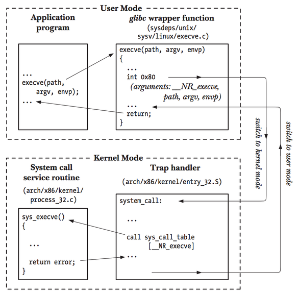

# Session-7

## 概览

### System Call

系统调用完成以下职责：

- 设置分辨系统调用及其参数的信息
- 完成内核态转变
- 从系统调用获取运行结果

Linux中，系统调用通过EAX指定系统调用号，通过EBX、ECX、EDX、ESI、EDI、EBP寄存器完成参数传递



- 应用通过C库调用系统调用的包装层
- 包装层指定系统调用号至EAX
- 包装层向指定寄存器传递系统调用参数
- 通过中断指令调用系统调用（int 0x80 or syscall or sysenter）
- 执行中断处理，调用对应的内核代码
- 调用服务

由于unikraft并没有用户空间与系统空间的区别，运行Linux程序时需要”兼容“曾经的系统调用方式

### 二进制程序的装载与运行

Unikraft需要满足以下要求：

- 在启动时将ELF二进制文件传递给Unikraft
- 将ELF文件装载到对应的内存位置并且运行

### Unikraft 系统调用铺垫

以下面这一小段代码为例子：

```
mov	edx,4		; message length
mov	ecx,msg		; message to write
mov	ebx,1		; file descriptor (stdout)
mov	eax,4		; system call number (sys_write)
syscall		    ; call kernel
```

执行完毕后进入handler代码，该部分代码仍然是一段中间层面代码，打印调试信息并且向底部传递参数

```
void ukplat_syscall_handler(struct __regs *r)
{
	UK_ASSERT(r);

	uk_pr_debug("Binary system call request \"%s\" (%lu) at ip:%p (arg0=0x%lx, arg1=0x%lx, ...)\n",
		    uk_syscall_name(r->rsyscall), r->rsyscall,
		    (void *) r->rip, r->rarg0, r->rarg1);
	r->rret0 = uk_syscall6_r(r->rsyscall,
				 r->rarg0, r->rarg1, r->rarg2,
				 r->rarg3, r->rarg4, r->rarg5);
}
```

往下进入一段选择程序，调用真正的系统调用

```
switch (nr) {
	case SYS_brk:
		return uk_syscall_r_brk(arg1);
	case SYS_arch_prctl:
		return uk_syscall_r_arch_prctl(arg1, arg2, arg3);
	case SYS_exit:
		return uk_syscall_r_exit(arg1);
    ...
```

以下为向unikraft添加系统调用的示例：

```
ssize_t write(int fd, const void * buf, size_t count)
{
    ssize_t ret;

    ret = vfs_do_write(fd, buf, count);
    if (ret < 0) {
        errno = EFAULT;
        return -1;
    }
    return ret;
}
```

用宏定义

```
#include <uk/syscall.h>

UK_SYSCALL_DEFINE(ssize_t, write, int, fd, const void *, buf, size_t, count)
{
    ssize_t ret;

    ret = vfs_do_write(fd, buf, count);
    if (ret < 0) {
        errno = EFAULT;
        return -1;
    }
    return ret;
}
```

或者

```
#include <uk/syscall.h>

UK_SYSCALL_R_DEFINE(ssize_t, write, int, fd, const void *, buf, size_t, count)
{
    ssize_t ret;

    ret = vfs_do_write(fd, buf, count);
    if (ret < 0) {
        return -EFAULT;
    }
    return ret;
}
```

最后在Makefile.uk中进行添加

```
UK_PROVIDED_SYSCALLS-$(CONFIG_<YOURLIB>) += <syscall_name>-<number_of_arguments>
```


## Work

### Run Binary Applications

运行run_app.sh，加载已经准备好的程序镜像并运行

```
$ ./run_app.sh
Usage: ./run_app.sh [-l] <app>
Possible apps:
bc bc_static bzip2 client client_go client_go_static client_static echo gzip 
gzip_static haproxy helloworld helloworld_cpp helloworld_cpp_static 
helloworld_go helloworld_go_static helloworld_rust helloworld_rust_static_gnu 
helloworld_rust_static_musl helloworld_static ls nginx nginx_static openssl 
python redis redis7 redis_static server server_go server_go_static 
server_static sqlite3 sqlite3_static
```

以helloworld_go为示例：

```
./run_app.sh helloworld_go
```


### Debug Run

采用以下命令，显示完整的调试信息

```
./run.sh -k app-elfloader_kvm-x86_64_full-debug ../static-pie-apps/lang/c/helloworld > debug.txt
```

通过debug.txt，可以找到完整系统调用的调试信息

```
[    1.029214] dbg:  [libvfscore] <main.c @  116> (int) uk_syscall_r_open((const char*) 0x218025, (int) 0x0, (mode_t) 0x0)
[    0.813990] dbg:  [libvfscore] <main.c @  116> (int) uk_syscall_r_open((const char*) 0x218025, (int) 0x0, (mode_t) 0x0)
```

可以了解到系统调用时的具体参数，调用文件与行数

### 自行构建

在app-elfloader文件夹中，运行以下命令进行配置

```
WITH_ZYDIS=y make menuconfig
```

具体配置参见下面内容描述

- Platform Configuration中选择 KVM guest
- Platform Configuration -> Platform Interface Options中选择 Virtual Memory API
- Library Configuration 中选择 ukmmap、ukvmem与posix-mmap
- Library Configuration -> ukvmem 中选择 Use dedicated *
- 若使用文件系统，选择Library Configuration -> vfscore: Configuration -> Automatically mount a root filesysytem ，使用9pfs
- 如果需要网络，选择 lwip

最后，运行如下命令构建

```
WITH_ZYDIS=y make
```

### Create your Own Application

以ls命令为例子

```
mkdir myls
cd myls
../extract.sh /usr/bin/ls
cp /usr/bin/ls .
tree .
```

目录结构为

```
.
├── lib
│   └── x86_64-linux-gnu
│       ├── libc.so.6
│       ├── libpcre2-8.so.0
│       └── libselinux.so.1
├── lib64
│   └── ld-linux-x86-64.so.2
└── ls
```

运行命令

```
./run.sh -r ../dynamic-apps/myls/ /ls
```


