# Assignment-2 成果简介

Assignment2文件夹下包括以下目录：

```
.
├── libvirt
├── james.org
└── notes
```

- libvirt：包含nginx_vm.xml与nginx_qemu-x86_64，nginx_vm.xml是libvirt启动nginx镜像的描述文件，nginx_qemu-x86_64是对app-nginx完成构建的镜像文件
- james.org：基于libvirt-go实现的简易虚拟机管控后端服务，包括创建、查询、删除、挂起、恢复虚拟机的基本功能
- notes：包含对qemu命令选项迁移至libvirt的基本记录

## Nginx镜像的迁移

由于libvirt未直接支持unikernel运行，需要编写xml描述如何启动unikernel镜像。本节依照基础镜像启动、网络模块支持与文件系统支持逐层描述，最终完成Nginx镜像的迁移运行。

### Helloworld镜像运行

编写helloworld.xml，内容如下：

```
<domain type='kvm'>
  <name>vm_helloworld</name>
  <memory unit='KiB'>2048</memory>
  <currentMemory unit='KiB'>2048</currentMemory>
  <vcpu placement='static'>1</vcpu>
  <os>
    <type>hvm</type>
    <kernel>/var/lib/libvirt/images/hello_qemu-x86_64</kernel>
  </os>
  <devices>
    <graphics port="-1" type="vnc" />
  </devices>
</domain>
```

- 所有vm的标签以domain开始，type表示采用哪种类型的hypervisor，此处我们选择kvm
- name：表示虚拟机的命名，不允许重复
- memory：引导时分配的最大内存
- currentMemory：真正为虚拟机分配的内存，需要保证比maxMemory少
- vcpu：为虚拟机分配的cpu数目
- os-type：在虚拟机上运行OS的类型，hvm表示运行于裸机
- os-kernel：运行的镜像文件
- devices-graphic：图像设备，此处配置表示自动启动一个vpc-server

准备工作完成后，创建虚拟机

```
virsh create helloworld.xml
```

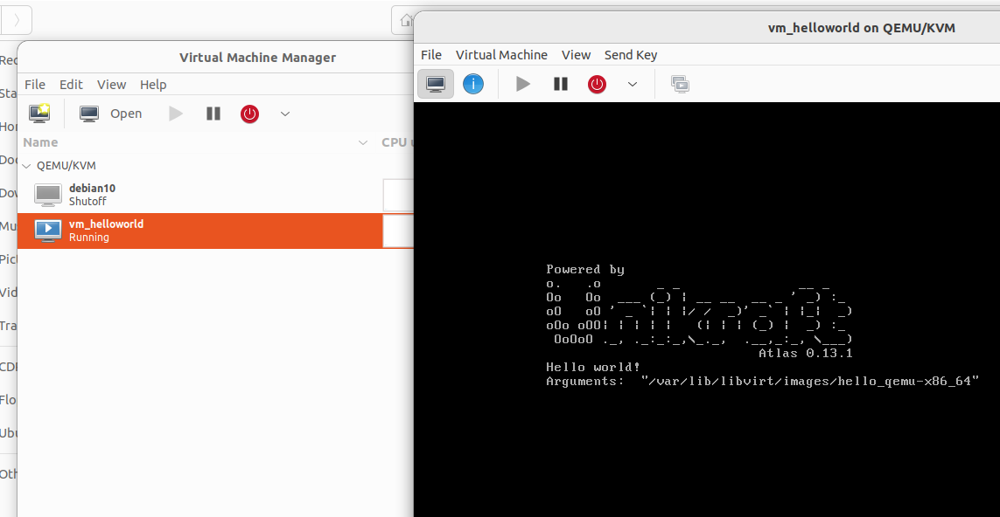

启动virt-manager，可以查看镜像的运行情况

### http-reply镜像运行

在基础镜像之上添加网络模块使得虚拟机具备基本的网络功能，增加设备如下

```
<interface type='bridge'>
    <mac address='00:16:3e:6d:45:d0'/>
    <source bridge='virbr0'/>
    <target dev='en0'/>
    <model type='virtio'/>
    <driver name='vhost' txmode='iothread' ioeventfd='on' event_idx='off'/>
    <address type='pci' domain='0x0000' bus='0x00' slot='0x03' function='0x0'/>
</interface>
```

添加bridge类型的网桥设备，通过virbr0与物理机进行连接，采用virtio虚拟化方式

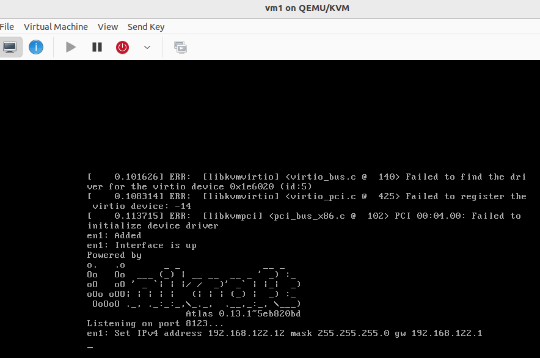‘

启动虚拟机后，可以看到网络设备初始化成功，下面测试网络功能

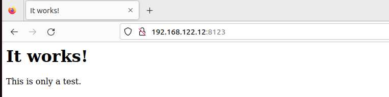

能够成功获取到网页，网络模块添加成功

### Nginx镜像运行

Nginx镜像在httpreply的基础上还需要增加对于挂载文件的支持，主要增加以下描述

```
<filesystem type='mount' accessmode='mapped' fmode='766' dmode='755'>
  <source dir='/var/lib/libvirt/fs/fs0' />
  <target dir='fs0' />
  <driver type='path'/>
</filesystem>
```

启动镜像

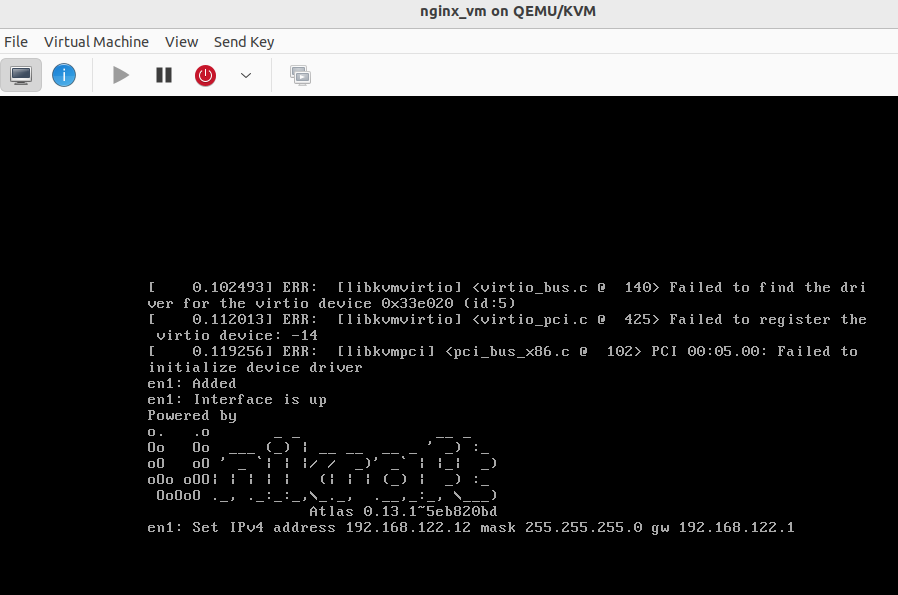

启动基本成功，测试是否可以获取到index.html

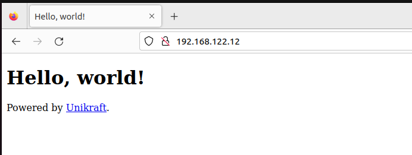

运行成功，至此完成Nginx镜像至libvirt的迁移

## 简易libvirt 虚拟机管理后端

进入到james.org/manage目录下，运行

```
go mod tidy
```

运行后端服务

```
go run main.go
```

如果一切正常，应当出现以下输出

```
[GIN-debug] DELETE /vm                       --> main.registRouter.func1 (3 handlers)
[GIN-debug] POST   /vm                       --> main.registRouter.func2 (3 handlers)
[GIN-debug] GET    /vms                      --> main.registRouter.func3 (3 handlers)
[GIN-debug] GET    /shutdown                 --> main.registRouter.func4 (3 handlers)
[GIN-debug] POST   /vm/suspend               --> main.registRouter.func5 (3 handlers)
[GIN-debug] POST   /vm/resume                --> main.registRouter.func6 (3 handlers)
[GIN-debug] POST   /vm/snapshot              --> main.registRouter.func7 (3 handlers)
```

### 创建虚拟机

创建虚拟机的方式主要分为两种，通过指定xml文件名读取xml内容创建，创建URL如下

```
POST http://localhost:9000/vm?xmlName='demo.xml'&xmlContent='<domain ...'
```

若xmlName参数存在通过读取文件内容创建虚拟机

在create.go中定义libvirt虚拟机xml的存放路径，可以依据自己的路径进行修改

```
const (
	XML_DIR = "/home/jam/Desktop/libvirt"
)
```

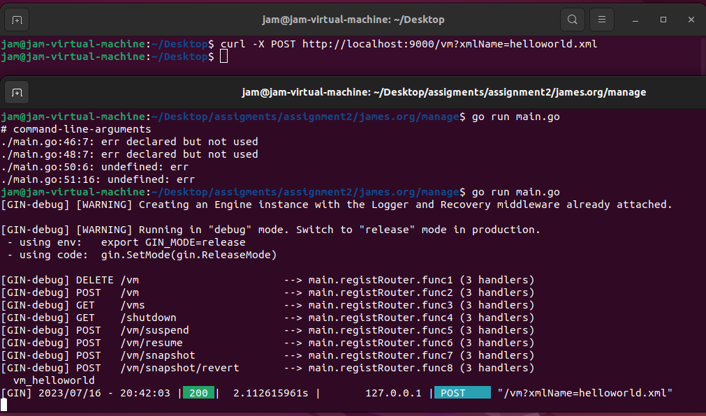

如上图所示，当xmlName为helloworld.xml时，将会在/home/jam/Desktop/libvirt文件夹下寻找helloworld.xml，若成功寻到后会利用其中内容创建虚拟机

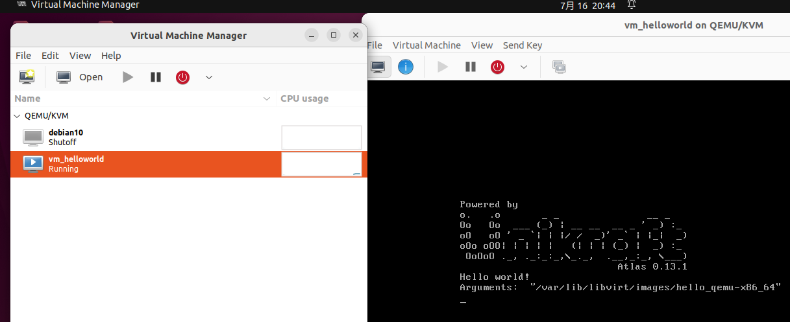

若采用xmlContent参数，将以xmlContent为配置创建虚拟机，如

### 查询虚拟机

通过查询接口，获取正在运行的vm

```
GET http://localhost:9000/vms
```

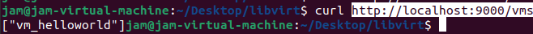

### 挂起虚拟机

通过挂起接口，将正在运行的虚拟机挂起

```
POST  http://localhost:9000/suspend?name=vm_helloworld
```

通过name指定要挂起的虚拟机名称

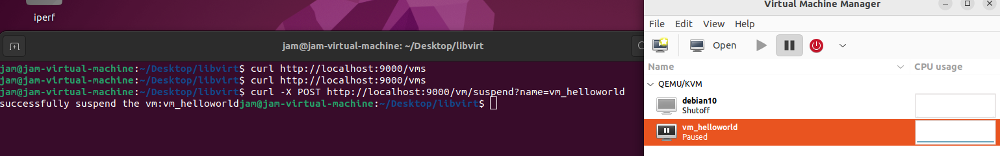

### 恢复虚拟机

通过恢复接口，恢复虚拟机运行

```
POST  http://localhost:9000/resume?name=vm_helloworld
```

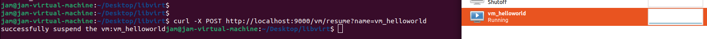

### 删除虚拟机

通过删除接口，删除虚拟机

```
DELETE http://localhost:9000/vm?name=vm_helloworld
```

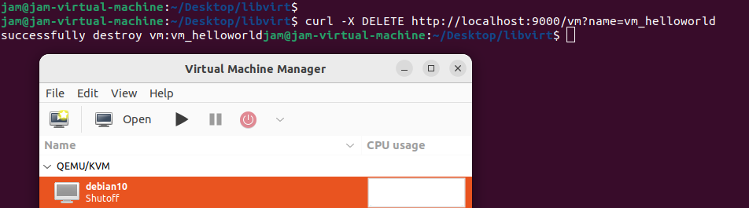

### 快照创建

根据文档内容编写了虚拟机的快照拍摄与恢复模块，由于对此接口熟悉度不足未进行测试，此处只做简单的介绍

```
POST   http://localhost:9000/vm/snapshot?name=vm1
```

通过该接口可以进行拍照拍摄，通过name指定要操作的虚拟机。同时创建快照需要传递xml配置内容，直接在body中写入xml配置内容

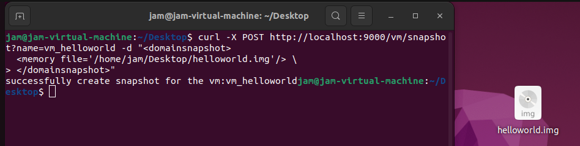
