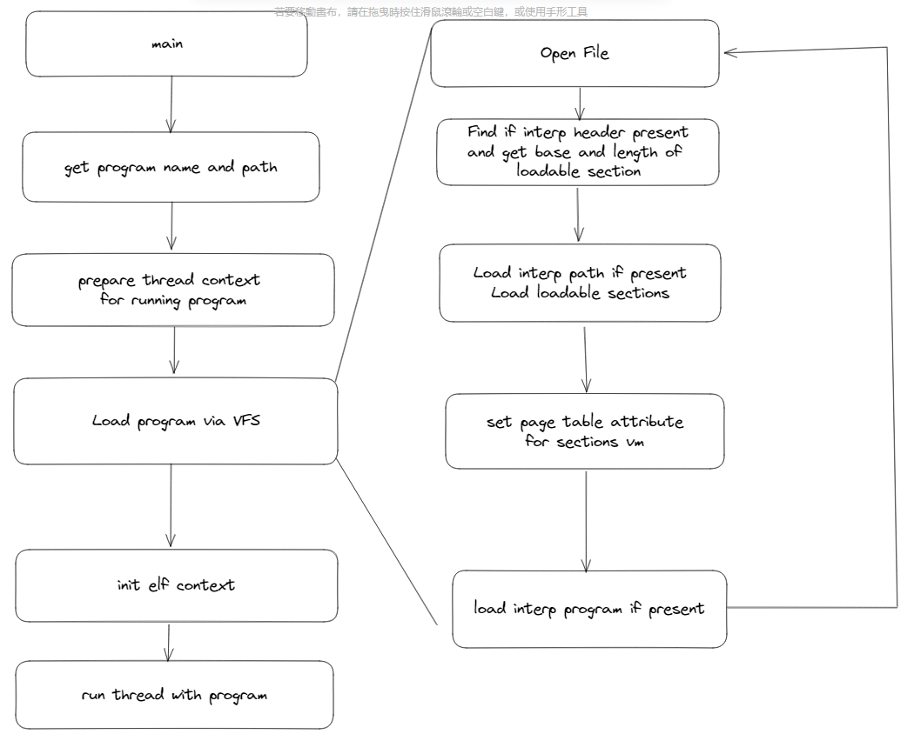
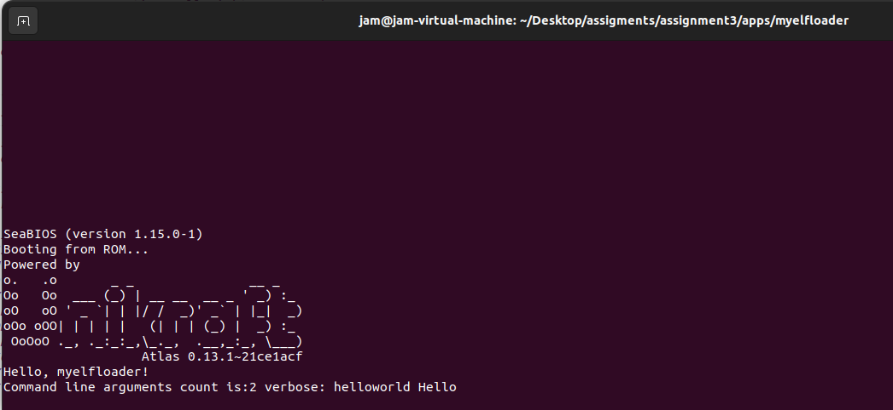
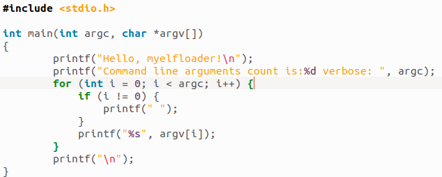
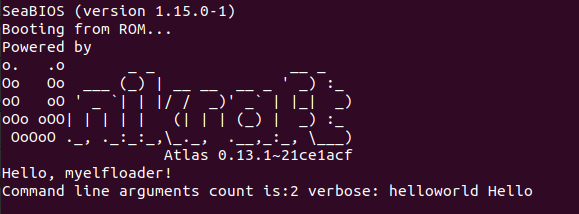
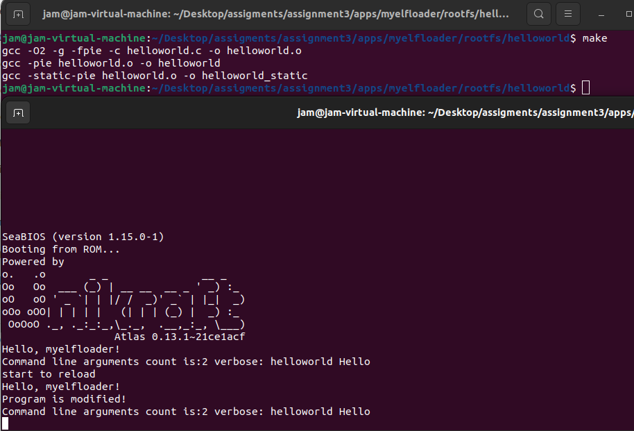

# Assignment3成果简介

## 实现ELF动态链接

这部分的实现参照了原项目app-elfloader的实现，流程设计如下：



- 通过命令行参数解析出需要加载的二进制运行文件的名称以及文件所在路径
- 创建线程上下文，准备运行加载的程序
- 通过虚拟文件系统加载程序，其详细步骤包括：
  - 以ELF格式打开文件
  - 获取ELF文件可加载段的起始位置与长度，如果存在interp段则设置标志位以进行后续处理
  - 若存在interp段加载段中包含的文件路径，加载所有可加载的段
  - 在页表中设置加载段范围页的标志位，符合ELF文件规定的保护权限
  - 如果存在interp段，递归地加载interp段描述的解释器文件
- 随后初始化运行线程的上下文，为程序运行作准备
- 启动新的线程运行程序

### 准备阶段

#### 解析文件名称与路径

```
path = argv[1];
program_full_path = strdup(path);
program_name = get_simple_name_from_path(program_full_path);
argv = &argv[2];
argc -= 2;
```

该部分通过命令行参数获取加载文件的全路径，随后通过全路径中'/'字符出现的最后位置分割字符串，得到文件的简单名称。随后将命令行参数的前两项丢弃，准备将剩余参数传递给后续运行程序

#### 创建线程上下文

```
app_thread = uk_thread_create_container(uk_alloc_get_default(),
                                            uk_alloc_get_default(),
                                            PAGES2BYTES(CONFIG_APPELFLOADER_STACK_NBPAGES),
					                        uk_alloc_get_default(),
					                        false,
					                        program_name,
					                        NULL, NULL);
```

该部分通过默认方式创建线程，为后续程序运行作准备

### 加载ELF程序

加载ELF程序涉及的知识相对较多，因此通过细分描述的方式说明

#### 开启文件

```
fd = open(path, O_RDONLY);
check whether file exists
int state_code = fstat(fd, &f_stat);
check file status
Elf *elf = elf_open(fd);
check elf format

load section and set page table
...

elf_end(elf)
close(fd)
```

通过open打开文件，检查文件是否存在。随后通过fstat获取文件权限，检查是否具备足够的文件操作权限。之后以ELF格式打开文件，检查文件格式是否为ELF。各项正常后进行ELF解析加载、页表项设置等工作，最后记得释放相关资源。

#### 初步程序头解析

该步骤主要是初步解析ELF头以及程序头的一些信息，载入到自定义的elf_prog中，为后续初始化线程上下文作必要准备，并不执行实际的段加载动作。

```
GElf_Ehdr *hdr_ptr = gelf_getehdr(elf, &e_hdr);
for phdr in program headers {
    if phdr.pt_type == PT_INTERP {
        check if prog->interp.required is already true, we should reject multi interp ELF file for we do not support it now
        prog->interp.required = true;
    }
    if phdr.pt_type == PT_LOAD {
        update prog_lowrl and prog_upperl accoriding to p_hdr.p_paddr and p_hdr.p_memsz
    }
}
set prog's fields off, num, entsize, valen
```

原app-elfloader只支持加载具备单一INTERP段的ELF文件，这里沿用了其原来的设定。prog->interp.required 用于表示程序中是否存在INTERP段，在后续工作中需要根据该标志位决定是否进行INTERP段加载以及解释器程序的递归加载

找出段地址上下界的主要原因是需要初步判断是否可以加载并且计算出后续需要分配的内存大小，下面简要介绍prog设置的字段：

- off：程序头表的偏移地址，通常程序头表紧跟ELF头
- num：程序头表中条目的个数
- entsize：段头表中单个条目的大小
- valen：加载段的大小，执行真正加载操作前分配内存用

#### 执行段加载

此步骤进行真正的段加载操作

```
if( prog->interp.required ) {
    find interp header
    prog->interp.path = malloc(p_hdr.p_filesz);
    load_content_to_mem(fd, p_hdr.p_offset, (void*)prog->interp.path, p_hdr.p_filesz);
    prog->interp.path[p_hdr.p_filesz - 1] = '\0';
}
prog->vabase = uk_memalign(prog->a, __PAGE_SIZE, prog->valen);
prog->entry = (uintptr_t) prog->vabase + e_hdr.e_entry;
for loadable phdr in program headers {
    uintptr_t va_start = (uintptr_t)prog->vabase + p_hdr.p_paddr;
    uintptr_t va_end   = va_start + p_hdr.p_filesz;
    if prog->start is not initialized || va_start < prog->start {
        prog->start = va_start;
    }
    load_content_to_mem(fd, p_hdr.p_offset, (void*)va_start, p_hdr.p_filesz);
    zero out memory exceeds p_filesz in section
}
```

如果需要加载INTERP段，定位INTERP头并且向prog结构分配对应p_filesz的空间，将解释器文件路径加载到prog->interp.path中

随后为分配足够容纳所有加载段的空间，设置程序入口的地址

随后加载所有可加载的段，从文件中将对应的内容加载到内存中。注意到段在内存中的大小可能大于其在文件中的大小，需要将多出来那部分内存置零，至此完成段的加载工作

#### 加载段页表的设置

加载完成后，还需要根据程序头中的描述对段所在内存对应的页表进行标志位设置

```
for loadable phdr in program headers {
    uintptr_t va_start = (uintptr_t)prog->vabase + phdr.p_paddr;
    uintptr_t va_end   = va_start + phdr.p_memsz;
    va_start = PAGE_ALIGN_DOWN(va_start);
    va_end   = PAGE_ALIGN_UP(va_end);
    uintptr_t valen   = va_end - va_start;
    uk_vma_set_attr(vas, va_start, valen,
                   ((phdr.p_flags & PF_R) ? PAGE_ATTR_PROT_READ  : 0x0) | 
                   ((phdr.p_flags & PF_W) ? PAGE_ATTR_PROT_WRITE : 0x0) | 
                   ((phdr.p_flags & PF_X) ? PAGE_ATTR_PROT_EXEC  : 0x0), 
                   0);
}
```

对每个可加载段获取其在内存中的上下界，根据程序头描述设置其对应页表项的标志位。保证程序具备足够的内存访问权限运行

#### 递归加载解释器

```
if (prog->interp.required) {
    prog->interp.prog = do_elf_load_vfs(a, prog->interp.path, "<interp>");
}
```

完成以上内容后，如果存在INTERP段，根据加载的内容递归地加载解释器程序的内容

### 初始化上下文

该部分代码沿用了原elf-apploader中的相关代码，主要是将一些程序运行需要的参数压入线程的栈中，此处需要注意存在INTERP情况与不存在时的不同处理之处。

```
if (prog->interp.required) {
	struct elf_prog *interp = prog->interp.prog;
	ukarch_ctx_init(ctx, ctx->sp, 0x0, interp->entry);
} else {
	ukarch_ctx_init(ctx, ctx->sp, 0x0, prog->entry);
}
```

如果存在INTERP段，初始执行的RIP指针将会被设置为解释器程序的入口而非加载程序的入口，具体可参考[dynamic_link](https://refspecs.linuxbase.org/elf/gabi4+/ch5.dynamic.html)中的解释

初始化结束后即可运行

### 运行结果

在挂载的rootfs中准备以下文件

```
├── helloworld
│   ├── helloworld
│   ├── helloworld.c
│   ├── helloworld.o
│   ├── helloworld_static
│   └── Makefile
├── lib
│   └── x86_64-linux-gnu
└── lib64
    └── ld-linux-x86-64.so.2
```

运行命令

```
qemu-guest -k build/myelfloader_qemu-x86_64 -e rootfs/  -a "env.vars=[ LD_LIBRARY_PATH=/lib LD_SHOW_AUXV=1 ] -- /helloworld/helloworld Hello
```



## 热部署实现思路

热部署的思想在于修改文件后不需要重启整个系统就可以重新运行，在Java体系中与JVM的类加载能力相关。借助曾经的Java编码经验，采用文件修改检测与重加载实现类似热部署的效果

在main.c中定义了如下结构：

```
struct app_record {
     char *path;
     char *app_name;
     struct timespec st_mtim;  /* the program last modified time, which is used to determine whether program has been modified */
     struct uk_sched *s;
     struct uk_thread *thread;
     struct app_record *next;
 };
```

用该结构记录加载程序的基本信息，用于检测到程序变化后快速地重新加载程序，此处打算以链表形式实现对所有加载文件的统一管理

```
int main() {
    ...
    struct app_record *head = malloc(sizeof(struct app_record));
    initialize head
    
    for(;;) {
        check_program_update(head, argc, argv, rand);
        sleep(8);
    }
}
```

在运行新的程序线程后，将程序信息包装为链表头，主程序每隔8秒进行一次检测

```
static void check_program_update(struct app_record *record, int argc, char *argv[], uint64_t rand[2])
{
    if (record == NULL) {
        return ;
    }
    struct timespec recent = get_current_mtim(record->path);
    if ((recent.tv_sec != record->st_mtim.tv_sec) || (recent.tv_nsec != record->st_mtim.tv_nsec)) {
        printf("start to reload\n");
        reload_application(record, argc, argv, rand);
    }
    if (record->next != NULL) {
        check_program_update(record->next, argc, argv, rand);   
    }
}
```

通过读取fstat中st_mtim实现对文件更改的检测，该项表示文件的最新修改时间，如果最新修改时间与加载时的修改时间不同则说明程序被修改，重新加载程序运行

### 运行效果

原helloworld程序



初步运行效果



更改程序，在"Hello， myelfloader!" 后打印 "Program is modified!"



更新程序后，程序的输出也相应得到了更新